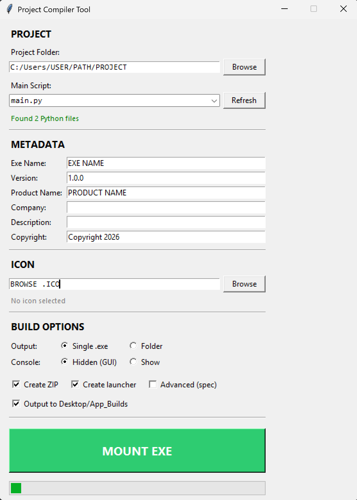

# Project Compiler Tool (PyInstaller GUI)

GUI wrapper around **PyInstaller** for building Windows executables with:
version metadata injection, icon support, and portable packaging.

---

## Demo

<p align="center">
  
</p>

---
> Status: Windows-focused (works great for Windows builds).  
> Goal: “one screen to ship a .exe + zip” without remembering PyInstaller flags.

## Features

- Auto-detect main scripts
- Version metadata injection
- `.ico` support
- One-file or one-folder build
- Optional launcher creation
- Portable ZIP generation
- Automatic PyInstaller installation (if missing)

---

## Quick Start

### 1) Install requirements
```bash
pip install -r requirements.txt
2) Run the app
python app_compiler.py
```

# Usage Flow
Select your project folder (or main script)
Pick build mode: one-file or one-folder
(Optional) Set app metadata:
Product name
Version
Company
Icon

Build
Export a portable ZIP (optional)

Notes
If Windows SmartScreen complains: that’s normal for unsigned executables. Make a special exception for the build created.
Some antivirus tools may flag one-file executables because of bundling behavior.

If your build fails, try:
updating PyInstaller
running the tool from a fresh venv
ensuring your script runs cleanly before packaging

Hopefully will be handy :)
